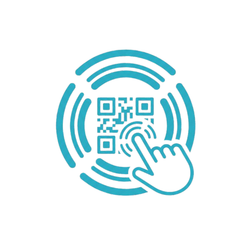

  
  <h1>ProxiTap</h1>

ProxiTap is a decentralized peer-to-peer communication app and walkie-talkie for Android. Designed specifically for off-grid or high-congestion environments (such as group scootering/cycling, hiking, or crowded festivals), ProxiTap runs completely locally over direct device-to-device Wi-Fi. It requires no cellular service, access points, or internet connectivity to keep you and your team in sync.

---

## 🚀 Features

* **Decentralized Peer-to-Peer Networking**: Connect directly using Android **Wi-Fi Aware (NAN)** for zero-configuration background links, or **Local Hotspot Mode** for maximum device compatibility.
* **Persistent WebRTC Audio**: Ultra-low-latency, full-mesh bidirectional voice channels.
* **Smart Auto-Reconnection**: If you ride or walk out of range, the app automatically transitions to a background polling state and re-establishes the connection the instant you return.
* **Hardware Push-To-Talk (PTT)**: Leave your phone pocketed. Intercepts Bluetooth headset media keys (like play/pause buttons) to toggle your mute state.
* **Lobby Customization**: Secure lobbies with entry PINs, configure target audio bitrates, and share access instantly.
* **Dynamic Bitrate Scaling**: Automatically adjusts audio encoding down to **2 kbps** in extreme conditions to preserve communication, and up to **256 kbps** in clear conditions.
* **Connection Health Indicators**: Color-coded signal bars showing live latency, packet loss, and active bitrate.
* **Integrated Web Player**: Natively load and stream media inside the app with built-in desktop UA spoofing and web controls.

---

## 📖 User Guide

### 1. Hosting a Lobby
1. Open the app and enter your display name.
2. Select your desired network mode (**Wi-Fi Aware** is highly recommended; **Local Hotspot** is available for legacy devices).
3. Select the lobby style:
   * **Talk**: Optimized for high-quality 1-on-1 voice calls.
   * **Group Voice**: Mesh call where everyone can speak.
   * **Media Broadcast**: The host shares their device audio or browser music with listening peers.
4. Set an optional entry **PIN** and tap **Host Lobby**.
5. Share the generated **QR Code** or shareable **Deep Link** with your peers.

### 2. Joining a Lobby
* **Via QR Code**: Tap **Join Lobby** and scan the host's QR code.
* **Via Deep Link**: Tap a shared link. If ProxiTap is installed, it will automatically launch and place you into the lobby.
* *Note: If using Local Hotspot Mode, ensure your device joins the Host's Wi-Fi Hotspot network before connecting.*

### 3. Using Bluetooth Push-To-Talk (PTT)
* When connected, pressing the physical play/pause button on a connected Bluetooth headset or wired earbud will toggle your microphone mute status.
* You can also use the prominent on-screen **Mute/Unmute** button.

### 4. Broadcasting Media
* In a **Media Broadcast** lobby, hosts can tap the **🌐 Web Player** button.
* Paste or type a URL (such as a music streamer or video host).
* Use the **Desktop Mode Toggle** to load full desktop-compatible sites (useful for avoiding mobile redirections on sites like TikTok).

---

## ⚙️ Technical Architecture & Details

### 1. Networking Infrastructure
* **Wi-Fi Aware (NAN)**: ProxiTap leverages Android's Neighbor Awareness Networking APIs. This allows devices to discover and connect to one another directly without being connected to the same access point.
* **LocalOnlyHotspot**: For older Android devices lacking NAN support, the host initiates a local hotspot access point, and clients connect directly to the host's hotspot interface.
* **Mesh Signaling**: Signaling is handled via an embedded Ktor WebSocket server hosted on the host device, coordinating WebRTC connection requests, setting synchronization, and connection health metrics.

### 2. Audio Streaming Protocols
* **WebRTC**: Used for *Talk* and *Group Voice* lobbies. Direct peer-to-peer data channels and audio tracks are established via ICE/SDP negotiation. 
* **Direct UDP Streaming**: Used in *Media Broadcast* lobbies. System capture and browser audio are encoded via Opus and sent directly to clients using a custom packet header containing sequence numbers.
* **Fast-Catchup Buffering**: To prevent packet drops from building up playback latency over time, the direct UDP player drops delayed audio frames immediately rather than stretching the buffer, keeping stream lag under 200ms.

### 3. Connection Health Diagnostics & Congestion Control
* **Ping Polling**: The host and peers exchange periodic `PING` and `PONG` frames every 2 seconds to measure connection latency (RTT).
* **WebRTC RTP Stats**: WebRTC connection quality query extracts real-time packet loss percentages from `inbound-rtp` streams.
* **EMA Smoothing**: Latency and loss metrics are smoothed using an Exponential Moving Average:
  $$\text{SmoothedValue} = (\alpha \times \text{CurrentValue}) + ((1 - \alpha) \times \text{PreviousValue})$$
  *(where $\alpha = 0.35$)*
* **DTX Safeguard**: When Discontinuous Transmission (DTX) is active during silence, WebRTC yields no new stats. The poller detects this silence (`hasTraffic = false`) and suspends bitrate adjustments to prevent quality fluctuations.
* **Dynamic Bitrate Scaling Rules**:
  * **Extreme Strain** (RTT > 200ms or Loss > 8%): Instantly drops Opus encoding bitrate to **2 kbps** to maintain the basic voice link.
  * **Poor Link** (RTT > 120ms or Loss > 4%): Decreases bitrate index by 2 steps.
  * **Fair Link** (RTT > 70ms or Loss > 1.5%): Decreases bitrate index by 1 step.
  * **Slow-Start Upscaling**: Requires 3 consecutive excellent intervals (6 seconds of RTT < 40ms and Loss < 0.5%) to step quality back up.

---

## 🛠 Setup & Installation

1. Download the latest APK from the [Releases](https://github.com/TylerHats/ProxiTap/releases) page.
2. Install the APK on your Android device. 
3. **Permissions Required**: 
   * **Location**: Required by Android to scan for nearby Wi-Fi Aware/Hotspot networks.
   * **Record Audio**: Required for microphone capture.
   * **Nearby Devices**: Required for Bluetooth PTT earbud scanning and connections.

---

## 📜 Open Source & Licensing

ProxiTap is licensed under the **GNU General Public License v3 (GPLv3)**. 

It leverages the following open-source libraries:
- **WebRTC** (BSD 3-Clause)
- **Jetpack Compose & Kotlin/Ktor** (Apache 2.0)

*(All dependencies are fully permissive and strictly compatible with the GPLv3 license).*
